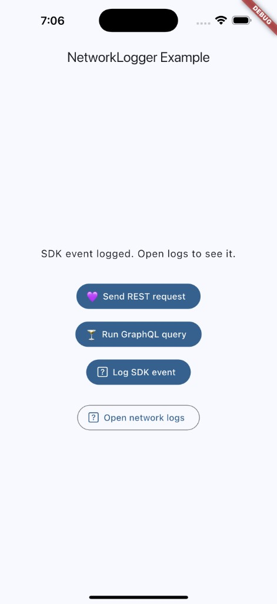
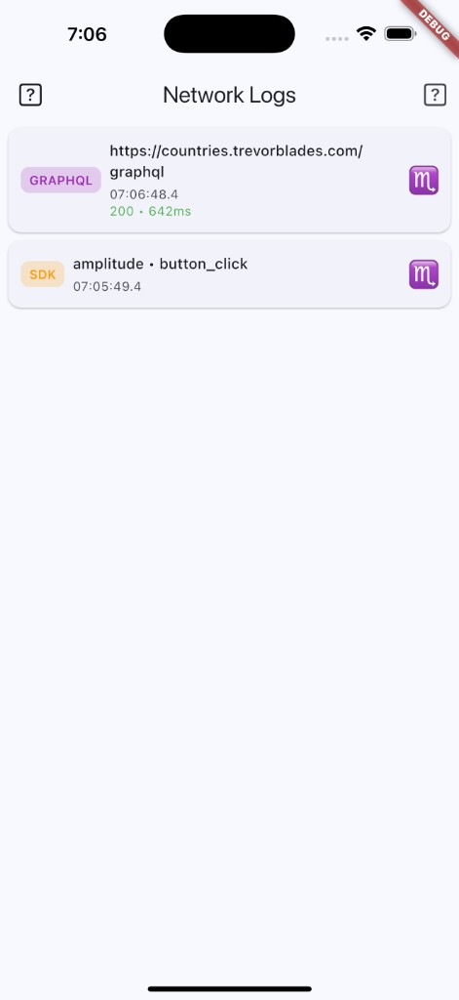
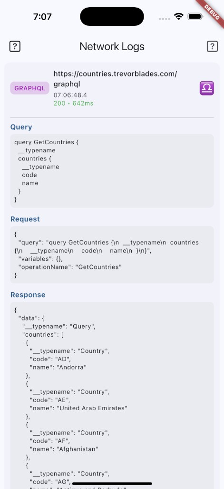

# network_log_viewer

A Flutter package that captures and displays **REST API**, **GraphQL**, and **SDK analytics** logs (Insider, Adjust, Amplitude, etc.) in one place—with request/response bodies, URLs, dynamic queries, and an in-app log viewer.

## Features

- **REST logging** – Logs URL, method, request/response body, headers, status code, and duration via a [Dio](https://pub.dev/packages/dio) interceptor.
- **GraphQL logging** – Logs endpoint URL, dynamic query/mutation text, variables, operation name, and full response (data + errors) via a [graphql](https://pub.dev/packages/graphql) Link.
- **SDK event logging** – Generic API to log analytics events (e.g. Insider, Adjust, Amplitude) so they appear in the same viewer.
- **In-app viewer** – Scrollable list of log entries with expandable tiles; tap to see full request/response, GraphQL query, and payloads.
- **Console output** – Optional `debugPrint` of log summaries in debug mode.
- **Configurable** – Max entries, enable/disable, optional console printing.

## Screenshots

| Example app (REST, GraphQL, SDK buttons) | Log list | Expanded GraphQL entry (query + response) |
|------------------------------------------|----------|-------------------------------------------|
|  |  |  |

## Getting started

### 1. Add the dependency

In your app’s `pubspec.yaml`:

```yaml
dependencies:
  flutter:
    sdk: flutter
  network_log_viewer: ^1.0.1
  dio: ^5.0.0   # required if you use REST logging
  graphql: ^5.0.0   # required if you use GraphQL logging
```

Then run:

```bash
flutter pub get
```

### 2. Initialize the logger

Call `NetworkLogger.init()` once before using the logger (e.g. in `main()`):

```dart
void main() {
  WidgetsFlutterBinding.ensureInitialized();
  NetworkLogger.init(
    enableConsolePrint: true,  // optional: print to console in debug
    maxEntries: 100,
    enabled: true,
  );
  runApp(MyApp());
}
```

### 3. Attach REST logging (Dio)

Add the interceptor to your Dio instance:

```dart
final dio = Dio(BaseOptions(baseUrl: 'https://api.example.com'));
dio.interceptors.add(NetworkLogger.dioInterceptor);
```

All requests and responses will be logged automatically.

### 4. Attach GraphQL logging

Prepend the logger link to your GraphQL link chain:

```dart
import 'package:graphql/graphql.dart';

final link = Link.concat(
  NetworkLogger.graphqlLoggerLink(
    endpointUrl: 'https://api.example.com/graphql',
  ),
  HttpLink('https://api.example.com/graphql'),
);
final client = GraphQLClient(link: link, cache: GraphQLCache());
```

### 5. Log SDK / analytics events

Call `logSdkEvent` whenever you send an event to Insider, Adjust, Amplitude, or any other SDK:

```dart
// After calling your analytics SDK:
Amplitude.instance.logEvent('screen_view', eventProperties: {'screen': 'Home'});
NetworkLogger.logSdkEvent('amplitude', 'screen_view', {'screen': 'Home'});

// Or from a single analytics facade:
void logEvent(String source, String name, Map<String, dynamic>? props) {
  mySdk.log(name, props);
  NetworkLogger.logSdkEvent(source, name, props);
}
```

### 6. Show the log viewer in your app

Push the full-screen log viewer so users can inspect logs and go back with the back button:

```dart
Navigator.of(context).push(
  MaterialPageRoute(
    builder: (_) => NetworkLogger.buildLogViewer(title: 'Network Logs'),
  ),
);
```

The viewer has a back button in the AppBar; tapping it calls `Navigator.pop(context)` so the user returns to the previous screen.

## Usage summary

| What you want | What to do |
|---------------|------------|
| Log REST calls | Add `NetworkLogger.dioInterceptor` to your `Dio` instance. |
| Log GraphQL operations | Use `NetworkLogger.graphqlLoggerLink(endpointUrl: ...)` before `HttpLink` in your link chain. |
| Log analytics (Insider, Adjust, Amplitude, etc.) | Call `NetworkLogger.logSdkEvent('source', 'eventName', payload)` next to your SDK call. |
| Show logs in-app | Push `NetworkLogger.buildLogViewer()` in a route; user closes with back button. |
| Clear logs | `NetworkLogger.store.clear()`. |
| Disable logging | `NetworkLogger.store.enabled = false`. |

## Example app

The `example/` folder contains a minimal Flutter app that:

- Initializes the logger
- Uses Dio with the logger interceptor to perform a sample REST request
- Logs a sample SDK event
- Has a button to open the log viewer

Run it to try the package and to capture screenshots for pub.dev:

```bash
cd example && flutter run
```

## API overview

- `NetworkLogger.init({...})` – Initialize once (maxEntries, enableConsolePrint, enabled).
- `NetworkLogger.store` – Access the log store (entries, stream, clear(), enabled).
- `NetworkLogger.dioInterceptor` – Dio interceptor for REST logging.
- `NetworkLogger.graphqlLoggerLink({endpointUrl})` – GraphQL Link for operation/response logging.
- `NetworkLogger.logSdkEvent(source, eventName, [payload])` – Log an SDK/analytics event.
- `NetworkLogger.buildLogViewer({title})` – Widget for the in-app log viewer (use with `Navigator.push`).

Exported types: `NetworkLogEntry`, `NetworkLogType`, `NetworkLogStore`, `NetworkLogViewer`.

## Requirements

- Flutter SDK (e.g. `>=1.17.0`)
- Dart `^3.10.7`
- For REST logging: add `dio` to your dependencies.
- For GraphQL logging: add `graphql` (and typically `gql_http_link`) to your dependencies.

## License

See the [LICENSE](LICENSE) file.

## Publishing this package to pub.dev

See [PUBLISHING.md](PUBLISHING.md) for step-by-step instructions on taking screenshots, updating the README, and publishing to pub.dev.
